# AI-Enabled Antarctic Sea-Ice, Iceberg Trajectory, and Navigation Decision Support System

> **Decision Support Disclaimer:** This system is designed as a research and decision-support platform for Antarctic maritime navigation. It does not provide regulatory safety certifications, nor does it guarantee collision avoidance or operational maritime safety.

## 1. Project Overview

This system integrates satellite Synthetic Aperture Radar (SAR) observation, computer vision, geospatial processing, multi-object tracking, trajectory forecasting, uncertainty quantification, spatio-temporal risk assessment, route optimization, and an AI explanation layer into one Antarctic navigation decision-support platform. 

The goal is to move beyond simple iceberg detection, offering a complete pipeline that predicts where icebergs will drift over the next 7 days, quantifies the uncertainty of those predictions, assesses the risk to planned vessel routes, and explains these complex scientific outputs in natural language using an Agentic AI layer and Voice-RAG integration.

## 2. Problem Statement

Navigating the Antarctic environment involves extreme challenges: sea-ice conditions, limited visibility (polar night, persistent cloud cover), and dynamic, constantly shifting iceberg hazards. While satellite observations can identify icebergs at a specific moment, navigating a vessel requires understanding future states. Simple point predictions are insufficient because iceberg drift is subject to complex oceanic and atmospheric forcing, leading to high uncertainty. Vessel route planning requires actionable decision support that combines detection, tracking, prediction, and risk assessment into a cohesive, temporal framework.

## 3. Why This System Is Needed

Merely detecting an iceberg is not enough for safe navigation. A vessel needs to know:
1. Where is the iceberg now? (Detection & Geolocation)
2. Where is it going? (Tracking & Trajectory Prediction)
3. How certain is that prediction? (Uncertainty Quantification)
4. Does it pose a threat to my path? (Risk Assessment)
5. What is a safer alternative? (Route Optimization)
6. Why did the system make this recommendation? (Agentic AI Explanation)

This system provides the complete sequence:
`Detection → Location → Tracking → Prediction → Uncertainty → Risk → Route → Explanation`

## 4. Key Objectives

- Demonstrate an end-to-end, scientifically rigorous pipeline for Antarctic hazard mitigation.
- Ensure strict immutability and reproducibility of validated scientific artifacts.
- Provide a deterministic, physics/ML-based core engine, cleanly separated from the AI explanation layer.
- Prove that natural language interfaces (Agentic AI, Voice-RAG) can reliably explain complex, deterministic navigational data without hallucinating critical safety metrics.

## 5. What the System Does

- **Detects** icebergs in Sentinel-1 SAR imagery using YOLO11n.
- **Geolocates** detections into Antarctic Polar Stereographic (EPSG:3031) metric space.
- **Tracks** iceberg identities over time using Kalman filtering and Hungarian association.
- **Predicts** trajectories up to 7 days (168h) using recurrent neural networks (Gated GRU).
- **Quantifies Uncertainty** via calibrated empirical Mahalanobis ellipses.
- **Assesses Risk** by intersecting vessel paths with predicted hazard regions.
- **Optimizes Routes** using A* search over dynamic hazard cost surfaces.
- **Explains** the results using a grounded RAG/Agentic AI architecture and Voice-RAG interface.

## 6. Complete System Architecture

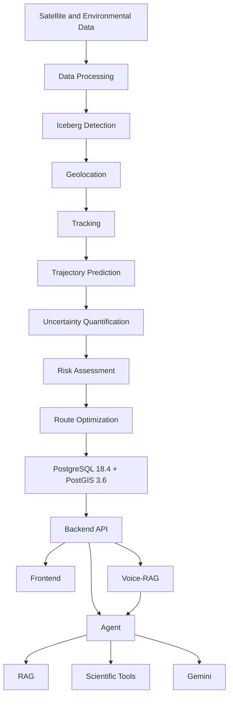

## 7. End-to-End Data Flow

```mermaid
flowchart LR
    A[Raw Data] --> B[Quality Control]
    B --> C[Preprocessing]
    C --> D[Model Inference]
    D --> E[Geospatial Transformation]
    E --> F[Temporal Tracking]
    F --> G[Prediction]
    G --> H[Uncertainty]
    H --> I[Risk]
    I --> J[Routing]
    J --> K[Database]
    K --> L[API]
    L --> M[Frontend / Agent / Voice]
```

## 8. Data Sources and Provenance

The system utilizes distinct datasets for different pipeline stages. It is critical to note that the training data for iceberg detection (Sentinel-1 SAR) is completely separate from the historical data used to train trajectory prediction models (BYU Database).

| Dataset | Purpose | Time Period | Status |
| ------- | ------- | ----------- | ------ |
| **Sentinel-1 SAR GRD** | Raw satellite imagery for detection | Recent | Verified |
| **Antarctic Grounded Iceberg SAR GT Dataset** | YOLO Detection Training/Validation | Multi-year | Verified |
| **BYU Antarctic Iceberg Tracking Database (v8.0)** | Trajectory Prediction Training/Validation | 1995-2026 | Verified |
| **GEBCO** | Bathymetry for routing/trajectory features | 2024 | Verified |
| **Copernicus / ERA5** | Environmental forcing (ocean currents, wind) | Historical/Recent | Verified |

### Data Provenance
```text
External/Public Dataset
        ↓
Downloaded / Acquired
        ↓
Checksum / Metadata
        ↓
Quality Audit
        ↓
Preprocessing
        ↓
Processed Dataset
        ↓
Scientific Pipeline
```

**Sentinel-1 Ground Truth:** Used exclusively for training and evaluating the YOLO iceberg detection model.
**BYU Tracking Data:** Used exclusively for training and evaluating historical trajectory prediction models (XGBoost, GRU). These are scatterometer/NIC-derived, *not* Sentinel-1 ground truth.
**Environmental Datasets:** Used as contextual features where actually available (e.g., static GEBCO bathymetry).

## 9. Sentinel-1 SAR Processing

Sentinel-1 provides Synthetic Aperture Radar (SAR) imagery, which is crucial for Antarctic operations because it penetrates cloud cover and operates during polar night.

- **Acquisition:** Ground Range Detected (GRD) products.
- **Normalization:** 16-bit to 8-bit normalized PNGs.
- **Tile Generation:** 1024×1024 pixel tiles.
- **Geolocation:** Tied to Sentinel-1 Ground Control Points (Tie Points).

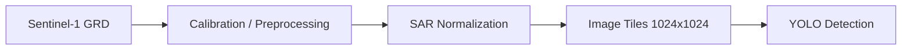

## 10. Iceberg Detection

The iceberg detection module identifies icebergs within the 1024x1024 SAR tiles.

- **Model:** YOLO11n (Ultralytics nano architecture, ~2.6M parameters).
- **Training Dataset:** 702 tiles (640x640 initially, scaled to 1024), carefully partitioned to prevent spatial autocorrelation leakage (entire scenes allocated atomically).
- **Splits:** Train (464 images), Validation (75 images), Test (163 images - locked).
- **Classes:** Single class (`0: iceberg`).

### Performance (Locked Blind Test)
The final detector prioritizes precise bounding box localization. Detecting small targets (< 1024 px^2) in high-clutter fast-ice regions remains a challenge, as dense backscatter mimics iceberg returns.

## 11. Geolocation

Transforming pixel coordinates from SAR tiles into real-world geographic coordinates.

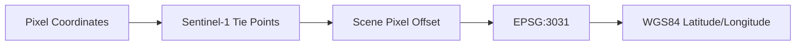

**Why EPSG:3031?** Antarctic Polar Stereographic (EPSG:3031) is used for all metric calculations (tracking, kinematics, routing) because it preserves local shapes and angles, and allows Euclidean distance/velocity calculations without severe polar distortion.

## 12. Iceberg Tracking

Tracking links individual iceberg detections across sequential satellite passes.

- **Filter:** Constant-velocity (CV) Kalman filter.
- **State Vector:** `[x, y, vx, vy]` in EPSG:3031.
- **Association:** Hungarian algorithm (`scipy.optimize.linear_sum_assignment`).
- **Cost Metric:** Mahalanobis distance gated by a chi-squared threshold.
- **Lifecycle:** `TENTATIVE` → `CONFIRMED` → `LOST` → `TERMINATED`.

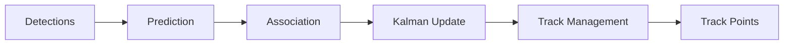

## 13. Trajectory Prediction

Forecasting where an iceberg will drift over 24h, 72h, 120h, and 168h horizons.

**Evolution:**
`Persistence` → `Kalman` → `XGBoost` → `LSTM` → `GRU` → `Gated Models`

- **Training Data:** BYU Tracking Database. Strict iceberg-level splitting (no identity leakage).
- **Features:** Track history (lagged displacements, velocity), GEBCO bathymetry, explicit missingness masks for sparse environmental data.
- **Selected Model:** **Gated GRU** (evaluated in Phase 4C) was selected as the primary trajectory model for its ability to handle temporal sequences, outperforming XGBoost and baselines.

## 14. Predictive Uncertainty

Point predictions are insufficient for safety. We calculate spatial uncertainty regions.

```text
Prediction + Residual Calibration + Empirical Mahalanobis Geometry = Spatial Uncertainty Region
```

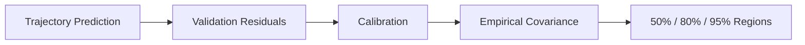

- **Calibration:** Empirical residuals computed on a held-out validation set.
- **Coverage:** Regions are guaranteed empirically to cover 50%, 80%, and 95% of future positions.
- **Geometry:** Stored as EPSG:3031 ellipses, output as WGS84 GeoJSON polygons.

## 15. Risk Assessment

Determines the navigational threat an iceberg poses to a vessel.

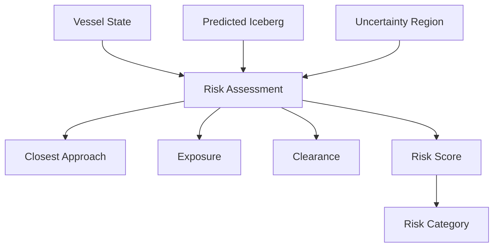

**Categories (Decision Support Only):**
- CLEAR: [0, 0.2)
- LOW: [0.2, 0.4)
- ELEVATED: [0.4, 0.6)
- HIGH: [0.6, 0.8)
- CRITICAL: [0.8, 1.0]

> These are project decision-support categories, not regulatory maritime classifications.

## 16. Safe Route Optimization

Calculates an optimal, hazard-avoiding path for a vessel.

- **Algorithm:** A* on an adaptive metric grid (EPSG:3031).
- **Temporal Synchronization:** Vessel arrival time at nodes is compared against the *forecasted* iceberg positions, not just current positions.
- **Constraints:**
  - HARD: Minimum 1,000m clearance from iceberg boundaries.
  - SOFT: Risk score and uncertainty exposure penalize edge costs.

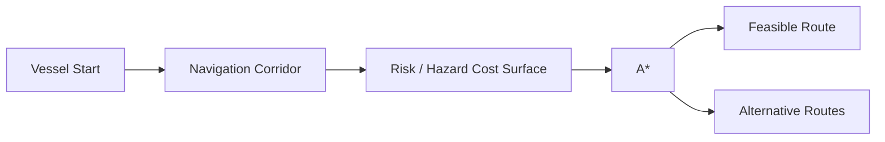

## 17. Database and PostGIS

The system relies on PostgreSQL 18.4 with PostGIS 3.6 for spatial querying (GiST indexing, geometry operations) and persistent state.

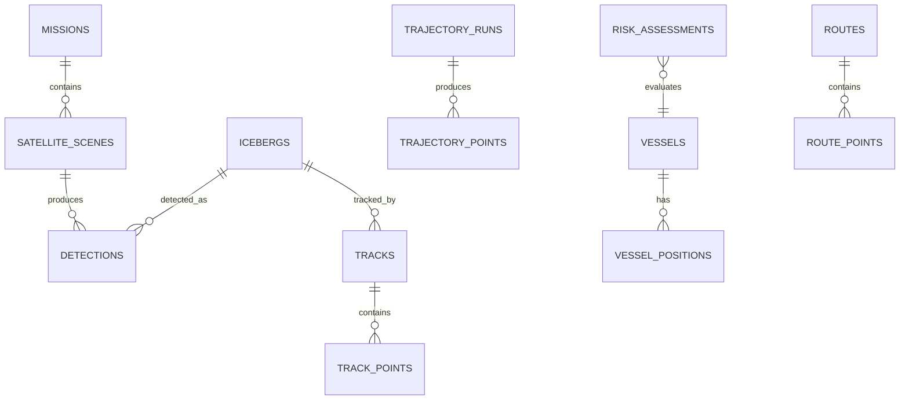

## 18. Backend Architecture

The backend acts as an API layer, database interface, and orchestration layer. It does *not* duplicate scientific algorithms (which live in `src/`).

```mermaid
flowchart TD
    A[Frontend] --> B[FastAPI Backend]
    B --> C[Scientific Services]
    B --> D[PostgreSQL/PostGIS]
    B --> E[Agent]
    E --> F[RAG (ChromaDB)]
    E --> G[Scientific Tools]
```

## 19. RAG System

The Retrieval-Augmented Generation system grounds LLM responses.

- **Static Knowledge:** ChromaDB index of project documentation, model cards, and architecture reports.
- **Live State (Not in ChromaDB):** Iceberg positions, risk scores, routes, and trajectories. These are fetched on-demand by the Agent via backend tools or Phase-7A artifact JSONs.

`RAG = project knowledge`
`Backend = live scientific state`
`Agent = combines them`

## 20. Agentic AI Layer

The Agent orchestrates tools to answer user queries using Google Gemini.

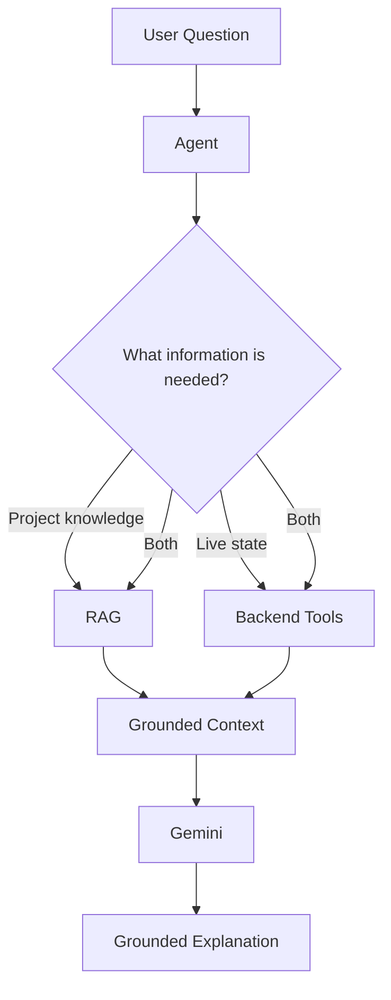

> Gemini does not replace the deterministic scientific engine; it explains its outputs.

## 21. Voice-RAG

An independent, frozen subsystem located in `D:\Voice_Rag`.

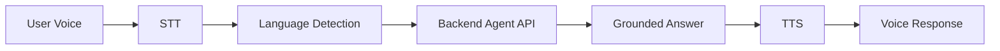

- Supports English, Hindi, and Auto-detect.
- Connects exclusively over HTTP (`POST /api/v1/agent/query`).

## 22. Frontend

The frontend (`iceberg main`) visualizes backend results.
- **Responsibilities:** Renders the map, icebergs, tracks, trajectories, uncertainty polygons, risk zones, routes, and provides the chat/voice interface.
- **Limitation:** The frontend visualizes backend outputs; it does *not* independently calculate scientific outputs.

## 23. Real-Time Data Flow

*Not currently implemented for live satellite ingestion.* The system currently operates on pre-processed demonstration datasets and historical databases. End-to-end data flow operates in near-real-time for the *simulated* scenarios provided in the database.

## 24. Complete End-to-End Example

This demonstrates a **verified demonstration scenario** (Phase 7A):

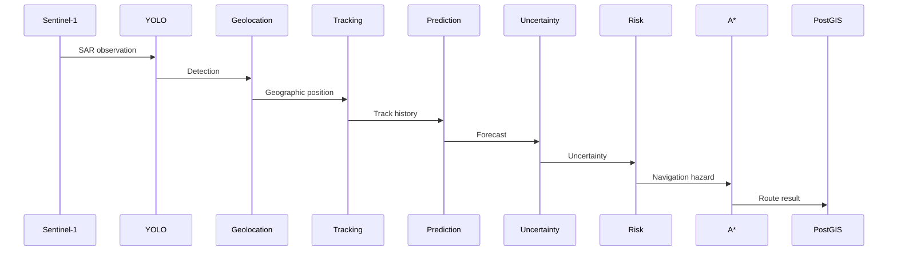

## 25. Experiments and Research Evolution

The project evolved scientifically through controlled experiments:

**YOLO Detection:**
- Baseline (640px) → EXP01 (1024px) → EXP02 (YOLO11s, 1024px) → ... → EXP07 (Final Candidate).
- Discovered that resolution scaling suppressed sea-ice clutter false positives but hurt small-object recall without appropriate hyperparameter tuning.

**Trajectory Prediction:**
- Persistence (Baseline) → Kalman (Baseline) → XGBoost (Phase 4B) → Sequence Models (Phase 4C).
- Discovered that XGBoost with environmental features (GEBCO bathymetry) improved 24h predictions, but sequence models (Gated GRU) better captured multi-day drift dynamics.

## 26. Validation and Testing

The system is rigorously validated using `pytest`.

- **Unit Tests:** Isolated components (e.g., coordinate transforms).
- **Integration Tests:** Pipeline chaining, Database ORM interactions, Agent-Backend communication.
- **End-to-End Tests:** Phase 7A full pipeline execution.
- **Regression Tests:** Checks enforcing SHA-256 immutability of frozen artifacts.

**Current Status:** 204 tests passed.

## 27. Model Performance

*Based on locked blind tests and frozen artifacts:*
- **YOLO11n (Final):** Strong localization (mean IoU ~80%), excellent clutter suppression. Small-object recall remains a bottleneck.
- **Trajectory (XGBoost 24h):** MAE 1.64 km (vs Kalman 2.47 km).
- **Trajectory (Persistence 168h):** MAE 5.10 km (outperforms linear extrapolation models due to stationary cohorts).

## 28. Project Limitations

- **Small Iceberg Detection:** Dim, sub-resolution point targets (< 1024 px^2) embedded in textured sea-ice matrices are frequently missed by the single-channel SAR detector.
- **Environmental Data:** Only static GEBCO bathymetry is uniformly available; dynamic forcing (wind, ocean currents) suffers from sparsity.
- **Trajectory Horizons:** Beyond 3 days, forecast uncertainty expands significantly.
- **Vessel Dynamics:** The routing engine assumes simplified kinematic constraints, not full hydrodynamic vessel modeling.
- **Status:** This is a research/development prototype, not a production maritime system.

## 29. Current Capabilities

- **Validated:** Individual iceberg detection, geographic localization, Kalman tracking, ML trajectory prediction, empirical uncertainty calibration, temporal risk assessment, and A* route optimization.
- **Validated:** Agentic AI explanations and Voice-RAG integration.

## 30. Future Work

### Short term
- Finalize frontend deployment optimizations.
- Enhance observability and logging.

### Medium term
- Integrate dynamic environmental forcing (Copernicus/ERA5) seamlessly into the trajectory API.
- Refine uncertainty calibration for extreme weather events.

### Long term (FUTURE WORK)
- **Sea-Ice Tracking:** Implement and validate a sea-ice drift module (not currently implemented).
- **Operational Ingestion:** Real-time satellite pipeline ingestion.
- **Multi-Vessel Optimization:** Fleet-wide risk management.

## 31. Repository Structure

```text
iceberg_project/
├── backend/
├── configs/
├── data/
├── database/
├── deployment/
├── docs/
├── experiments/
├── models/
├── outputs/
├── scripts/
├── src/
│   ├── api/
│   ├── database/
│   ├── detection/
│   ├── environment/
│   ├── geospatial/
│   ├── physics/
│   ├── rag/
│   ├── risk/
│   ├── routing/
│   ├── tracking/
│   ├── trajectory/
│   ├── uncertainty/
│   └── visualization/
├── tests/
├── .env
├── .env.example
├── README.md
└── requirements.txt
```

## 32. Installation

Requires Python 3.12.7, PostgreSQL 18.4, and PostGIS 3.6.

1. **Clone and setup virtual environment:**
   ```powershell
   python -m venv venv
   .\venv\Scripts\activate
   pip install -r requirements.txt
   ```
2. **Database setup:** Ensure PostgreSQL is running and create the `antarctic_navigation` database with the `postgis` extension.

## 33. Configuration

Copy `.env.example` to `.env`:
```env
GEMINI_API_KEY=YOUR_GEMINI_API_KEY
GEMINI_MODEL=gemini-1.5-flash
```

> **Security Note:** The Gemini API key is server-side only and must never be placed in frontend code, Git, README, screenshots, logs, or Voice-RAG client code.

## 34. Running the System

1. **Start PostgreSQL/PostGIS**
2. **Start Backend API:**
   ```powershell
   python -m uvicorn src.api.app:app --host 0.0.0.0 --port 8000
   ```
3. **Start Voice-RAG (in separate directory):**
   ```powershell
   cd D:\Voice_Rag
   python -m uvicorn src.api.routes:app --host 0.0.0.0 --port 8001
   ```
4. **Start Frontend (in separate directory):**
   ```powershell
   cd "D:\Iceberg Detection Antarctica Data\iceberg-main"
   npm run dev
   ```

## 35. Testing

Run the full suite of unit, integration, and regression tests:
```powershell
python -m pytest tests/ -q
```

## 36. Reproducibility

All scientific model weights (`best.pt`, `weights.pt`) and calibration artifacts are version-controlled, frozen, and SHA-256 verified by the test suite to guarantee that subsequent integration work does not alter validated scientific results.

## 37. Security

- All API keys are loaded via environment variables.
- Voice-RAG proxy prevents direct exposure of backend internal states.
- Database credentials must be configured securely in production.

## 38. Scientific Integrity

Scientific computation stays deterministic. Models stay frozen after validation. The backend owns the scientific state. The frontend visualizes backend outputs. RAG provides knowledge. The Agent orchestrates tools. Gemini explains grounded results.

## 39. Important Design Decisions

**What this system deliberately avoids:**
- The frontend does *not* calculate risk, run A*, or predict trajectories.
- The frontend does *not* call Gemini directly.

**Actual Architecture:**
`Frontend → Backend → Scientific Engine → Database → Agent → RAG/Gemini → grounded response`

## 40. Conclusion

When a user asks, *"Is this route affected by the iceberg?"*, the request flows from the frontend to the Agent, which uses backend tools to fetch the current iceberg state, trajectory, uncertainty, risk, and route. It queries ChromaDB for scientific context, passes this grounded data to Gemini, and returns a factual explanation to the frontend, ensuring the operator receives transparent, deterministic decision support.
